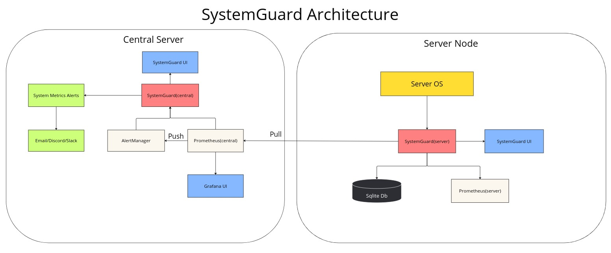

# SystemGuard 💂

  <table>
    <tr>
      <td align="center">
        
      </td>
      <td align="center">
        
      </td>
      <td align="center">
        
      </td>
    </tr>
    <tr>
      <td align="center">
        
      </td>
      <td align="center">
        
      </td>
      <td align="center">
        
      </td>
    </tr>
    <tr>
      <td align="center">
        
      </td>
      <td align="center">
        
      </td>
      <td align="center">
        
      </td>
    </tr>
  </table>

System Guard is a Flask app designed to monitor server stats such as CPU, Memory, Disk, and Network. It also provides real-time monitoring capabilities which can be useful for system administrators, developers, and DevOps engineers to keep track of their server's performance and troubleshoot issues. The app uses the `psutil` library to retrieve system stats and the `speedtest-cli` library to perform a network speed test.

## Features 🚀

- Lightweight, open-source, and free to use with a straightforward installation process, out-of-the-box monitoring solution.
- Capable of monitoring core server metrics like CPU, memory, disk usage, and network traffic.
- Analyze fluctuations in server performance with historical data displayed as charts.
- Centralized control panel for monitor/manage/analyze the fleet of servers.
- Role-Based Access Control (RBAC) for managing user permissions.
- Includes built-in security features such as authentication for login, logout, and signup.
- Analuze the network speed with the built-in speed test feature.
- Anaylze the suspicious processes and terminate them with a single click.
- Anaylze the network statistics with the built-in network statistics feature.
- Anaylze the subnet for security vulnerabilities with the built-in security analysis feature.
- Option to download historical data in CSV format for detailed analysis (upcoming feature).
- Role-based dashboards tailored for Developer, Admin, IT Manager, and Manager roles (upcoming feature).
- Update security updates with a single click or automatically update to the latest version to simplify maintenance.

## Get started 🛠️

- Check the [documentation](https://systemguard.readthedocs.io/en/latest/installation.html) for installation instructions.

## Architecture 🏗️

## Tech Stack 🛠️

- **Frontend**: JavaScript, Bootstrap, Chart.js, Grafana
- **Backend**: Python, Flask, SQLAlchemy, SQLite, Prometheus, InfluxDB
- **Monitoring**: psutil, speedtest-cli, nmap, netstat

## Release Notes 📝

- Check the [Release Notes](/src/docs/Release.md) file for the latest updates.
- Check the [Release Instructions](/src/docs/release_instrunctions.md) file for the release process.

## Supported Systems 🖥️

- Most Linux distributions are supported, including Ubuntu, CentOS, and Debian.

## How does installation work? 🤔

The installation process is straightforward and can be completed in a few steps. The user needs to run a bash script that installs the required dependencies, sets up the database, create a conda environment, and add flask server to the cron job. The user can then access the SystemGuard web interface by visiting the server's IP address or domain name.

## Product Screenshots 📸

Check the product [screenshots](/src/docs/README.md) for a visual representation of the app.

## Why not use a Docker image? 🐳

A Docker image has not been created for this project because it requires access to the host machine in order to retrieve server stats. Therefore, it is not possible to obtain server stats from within a Docker container.

## Contributing 🤝

Contributions are always welcome! Please read the [contribution guidelines](/CONTRIBUTING.md) first.

## License 📝

This project is licensed under the MIT License - see the [LICENSE](/LICENSE) file for details.
